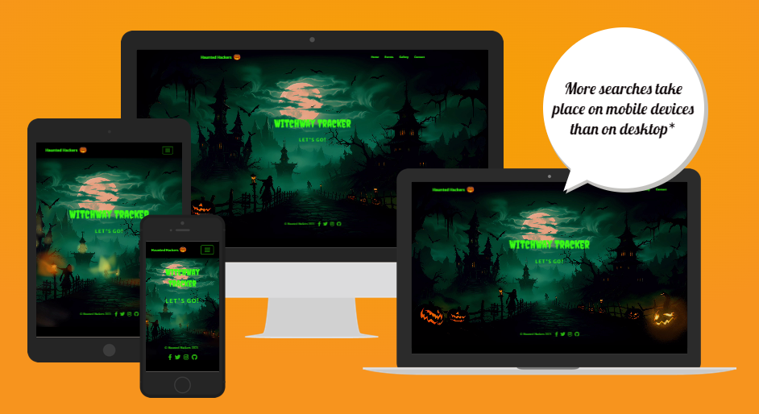
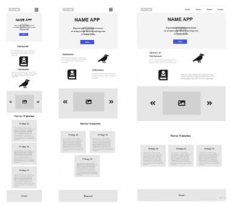
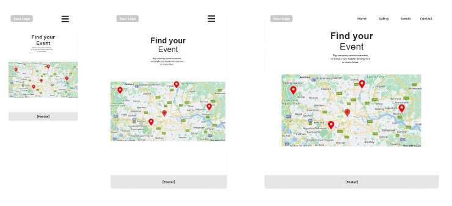
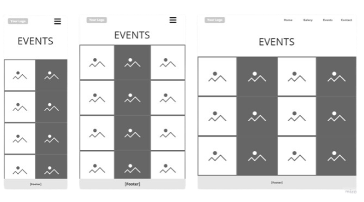
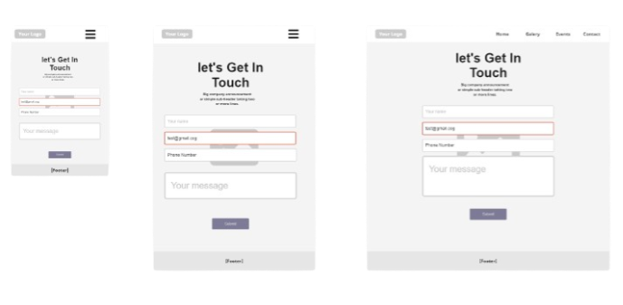

# PhantomForge - Halloween Hackathon

# Witchway Tracker - Halloween Events Locator

## Overview

"Witchway Tracker" is a responsive web application developed by the Haunted Hackers team during a hackathon. This Halloween-themed app is designed to help users locate and explore nearby Halloween events in the Dublin area. With its interactive features and sp00ky aesthetic effects, "Witchway Tracker" aims to provide a fun and informative experience for Halloween enthusiasts.

## Key Features

 Event Locator: Use the power of the Google Maps API to pinpoint the locations of Halloween-based events throughout the Dublin area. Each event is represented by a clickable pin that reveals essential information, such as date, time, ticket prices, and location.  
 Galleries: Explore a gallery of pictures showcasing attendees and their Halloween costumes. Get inspired or share your own fantastic costume creations with the Witchway Tracker community.  
 Contact Form: Have questions, feedback, or a chilling Halloween story to share? Use the contact form on our app to get in touch with us. We are here to assist and appreciate your sp00ky tales.

## Target Audience

"Witchway Tracker" is designed for Halloween enthusiasts and event-goers who want to make the most of the Halloween season in Dublin. Its target audience includes:

 Local Residents: Dublin residents seeking Halloween events in their area, whether it's haunted houses, costume parties, or family-friendly activities.  
 Tourists: Visitors to Dublin looking for a memorable and unique Halloween experience.  
 Costume Enthusiasts: Individuals who want to showcase their Halloween costumes and get inspired by others' creative outfits.  
 Event Organisers: Event organisers looking to promote their Halloween-themed events to a wider audience and provide location and ticket information.  
 Anyone with Sp00ky Stories: People who want to share their sp00ky tales or have questions about the app and its features.

## How to Use

To use "Witchway Tracker," simply visit our [website](https://sasantazayoni.github.io/PhantomForge/), and you'll be greeted by a captivating hero section that introduces the app. From there, you can navigate through the four main pages to discover nearby Halloween events, check out the user galleries, and even get in touch with us.

Have a sp00ktacular time using "Witchway Tracker" and make the most of the Halloween season in Dublin!

# User Experience (UX)

## User stories

 As a user, I want to immediately be able to understand the application on first glance and to navigate around without difficulty.  
 As a Dublin resident, I want to find nearby Halloween events such as haunted houses or costume parties so that I can plan my Halloween celebrations conveniently.  
 As a tourist visiting Dublin during Halloween, I want to discover unique and memorable Halloween events in the area, allowing me to make the most of my visit.  
 As a costume enthusiast, I want to browse through the application's galleries to gain inspiration from others' Halloween costumes.  
 As a costume enthusiast, I want to showcase my own creative outfits to the community.  
 As a person with sp00ky stories and experiences, I want to share my chilling Halloween tales.  
 As a user, I want to be able to connect with the someone for any enquiries or feedback.  
 As a user, I want to experience a sp00ky aesthetic that adds to the Halloween atmosphere and enjoy an engaging and fun user interface while using the application.  
 As a parent in Dublin, I want to use the application to find family-friendly Halloween activities and events to enjoy with my children during the Halloween season.

## Colour scheme

The choice of colors for a Halloween-themed website is crucial for creating the right atmosphere and enhancing the overall user experience. Here's an explanation for why the colors you've chosen are well-suited for a Halloween website:

#000 (Black):

 Black is often associated with darkness, mystery, and the unknown, making it a perfect choice for Halloween.  
 It represents the night, which is when many Halloween events and traditions take place, such as trick-or-treating and haunted houses.  
 Black also creates a spooky and eerie backdrop, which sets the stage for the Halloween theme.

#ff6100 (Pumpkin Orange):

 Orange is closely linked to Halloween because of pumpkins, a prominent symbol of the holiday. The bright orange color of pumpkins is iconic and evokes a festive, Halloween spirit.  
 The use of a vibrant and energetic shade of orange, adds warmth and excitement to the design, reminiscent of the glowing jack-o'-lanterns that adorn Halloween celebrations.

#ff8c00 (Spooky Orange):

 This slightly darker shade of orange adds depth and contrast to the design.  
 It complements the pumpkin orange and adds a sense of warmth and energy while retaining a spooky and mysterious feel.

#39ff14 (Bright Green):

 Bright green is reminiscent of eerie, supernatural elements often associated with Halloween, like witches, monsters, and eerie creatures.  
 It contrasts well with the black background and creates a visual pop, making it an excellent choice for call-to-action buttons or highlights on the website.

#fff (White):

 White serves as a striking contrast to the other darker colors and helps maintain readability, ensuring that text and content are easily visible.

## Imagery

The images used in the "Witchway Tracker" app are of paramount importance as they serve to visually engage and immerse users in the Halloween experience. High-quality and compelling images of Halloween events, costumes, and the overall atmosphere play a crucial role in capturing the essence of the holiday. These images help users preview and understand the events, locations, and activities available in Dublin during Halloween, making informed choices about which events to attend. Additionally, user-generated costume photos in the galleries foster a sense of community and inspire creativity among costume enthusiasts. The images set the tone, build anticipation, and enhance the overall user experience, making the app more inviting and exciting for all users, whether they are local residents, tourists, costume enthusiasts, or event organisers.

## Typography

Headings - [Creepster]():

 Style: Creepy, spooky, and decorative.  
 Use: Often used for Halloween-themed or horror-related content. Its distinctive style makes it suitable for headlines and titles in designs that require a playful or spooky aesthetic.

Body text - [Signika Negative]():

 Style: Clean, modern, and highly readable.  
 Use: A sans-serif font that's great for body text and general readability. It offers good legibility and is commonly used for paragraphs, articles, and other long-form text.

The combination of a decorative and playful font for headers (Creepster) with a clean and readable font for body text (Signika Negative) is a good choice, as it creates a contrast that enhances the overall design while maintaining readability and visual appeal.

# Features

The website consists of 4 pages. all are accessible from a navigation menu.
One is a 404 error page and one is a submission confirmation page for a form.

The website has below features:

## Navigation bar

 The navigation bar is visible on the top of each page of the website. It is fully responsive on different screen sizes and will adapt to mobile devices by changing into a burger menu, as shown in the image below.

Navigation scheme:

 On left side there is the website name which can be used as navigation link to the main page.
This has a spooky glow effect around both the website name and the pumpkin logo, as shown in the image below.  
 

 On right side there are four links or burger menu. It contains: - Home - Events - Gallery - Contact. When the buttons are hovered over, they display an eerie green glow effect.  
   
 

## Footer

 The footer consists of a spooky pumpkin banner with team name, year of website creation and social media and github repository links. The footer is consistent on all pages (except the hero page where it would be distracting) to add consistency to the whole site and tie the theme together. The footer icons have a glow effect that can be seen when hovering over them. The footer itself is fully responsive on different screen sizes.

## Home

 The home page of the website contains a large Hero image to attract the attention of the user. The image has spooky animations of flickering lanterns and glowing halloween pumpkins. It has the name of the website and a call to action button which links to the events page.

## Events

 The events page contains a map where you can see the different Halloween events happening in Dublin. Each pin on the map is represented by a halloween pumpkin and clicking on a pin shows the details of the spooky event with a link that opens the event in a new tab.  
   
 

## Gallery

 The gallery page showcases some of the previous events from previous years at WitchWay Tracker including people dressed in costumes and various event locations. It features a glow effect around the gallery photos and a carosel which can be toggled on or off to view the individual images in a larger format.  
   
   
 

## Contact

 The contact form can be filled out by users to ask questions, get more information or share interesting or spooky stories. On submission of the form, the user recieves a "submission successful" message  
   
 

# Future Features

 User can upload their own pictures  
 Users can add their own events  
 A backend for the emails  
 Real social media accounts  
 Event page can be modified to be in different cities

# Wireframes

All Wireframes were designed for larger screens such as laptops or computers; for medium sized screens such as tablets or large phones; and for small screens down to the smallest phone display. The wireframes can be viewed here:

## Home

## Events

## Gallery

## Contact

The wireframes do not fully correspond with the end product due to multiple changes made throughout the production phase.

# Technologies used

 HTML5 as a structure language.  
 CSS as a style language.
 Javascript as a scripting language.
 Bootstrap - Bootstrap@5.1.3 as a CSS framework to keep responsive, mobile first aproach.  
 We used the "Creative" template by StartBootstrap (https://startbootstrap.com/theme/creative)  
 Google fonts as a font resource.  
 GitHub as a software hosting platform to keep project in a remote location.  
 Git as a version-control system tracking.  
 Gitpod as a development hosting platform.  
 Miro as a planning, organisation and wireframing tool.  
 GIMP as an image editor.

# Testing

## Functionality testing

We used Mozilla web developer tools and Chrome developer tools throughout the project for testing and solving problems with responsiveness and style issues.

## Code Validation

At the end of the project we used the following websites to validate our code:

 [W3C CSS Validator](https://jigsaw.w3.org/css-validator/) to validate CSS  
 [Nu Html Checker](https://validator.w3.org/) to test HTML  
 [JavaScript validator](https://esprima.org/demo/validate.html) to test JavaScript

## Testing user stories (how user stories are satisfied)

 The application is intuitive and easy to use  
 As a Users easily find the information they are looking for about events  
 As a user I have a gallery that helps me with inspiration for my costume

### Tests

  

  
General

| Action                                                       | Expected behavious                                                     | Result |
| ------------------------------------------------------------ | ---------------------------------------------------------------------- | ------ |
| Copy url of the browser and paste it in browser. Press enter | Browser should load index.html                                         | Pass   |
| Scale up the window                                          | The contentent should not stretch over a certain size                  | Pass   |
| Scale down the window                                        | The contentent should be visible without having to scroll horizontally | Pass   |

  

  

  
Footer

| Action                                    | Expected behavious                   | Result |
| ----------------------------------------- | ------------------------------------ | ------ |
| Click on the LinkedIn icon in the footer  | It should open LinkedIn in a new tab | Pass   |
| Click on the Twitter icon in the footer   | It should open Facebook in a new tab | Pass   |
| Click on the Instagram icon in the footer | It should open Facebook in a new tab | Pass   |
| Click on the GitHub icon in the footer    | It should open Facebook in a new tab | Pass   |
| In small screens change for two lines     | Pass                                 |

  

  

  
Pages

| Action                                                                                 | Expected behavious | Result |
| -------------------------------------------------------------------------------------- | ------------------ | ------ |
| When you press the button on the home page must go to events page                      | Pass               |
| When you press some image on gallery page must open a carrossel                        | Pass               |
| When the user start fill in the contact form appear is mandatory to fill in the fields | Pass               |
| When the user click on the submit button must appear a mensage submited                | Pass               |
| When the user click on burguer nav bar must open down                                  | Pass               |
| When the user click on the pages links oh nav bar going to the select page             | Pass               |

  

## Lighthouse testing

Lighthouse testing came out to be at least 86 in all areas so is considered to pass.  

## Bugs

# Deployment

1. Log into [GitHub](https://github.com/).
2. Locate the [repository](https://github.com/SasanTazayoni/PhantomForge).
3. Locate the settings option along the options bar at the top of the page.
4. Locate the 'Pages' option on the left side bar and click on it.
5. Under the 'Branch' subheading there should be a drop-down menu - select 'Master' from the branch options.
6. Click the save button.
7. Github pages will build your website with the code supplied and begin hosting it when it is completed - the process usually takes a few minutes.
8. The website URL will now be visible on the green bar under the section header. This will remain there permanently and you can refer back to it at any time.

# Credits

Thanks to the Haunted Hackers team for a great experience and putting the project together:

 [Fernando](https://github.com/Goncalves95)  
 [Szymon](https://github.com/ObiOne84)  
 [Emanuel](https://github.com/EmanuelGustafzon)  
 [Richard](https://github.com/richard9106)  
 [Emily](https://github.com/dragon-fire-fly)  
 [Sasan](https://github.com/SasanTazayoni)
